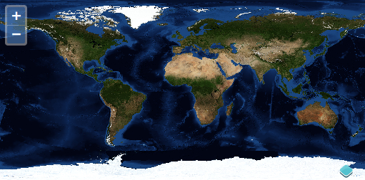

# Créez une carte

Dans OpenLayers, une carte est une collection de couches avec plusieurs `interactions` et `controls` pour gérer les interactions utilisateurs. Une carte est générée avec trois ingrédients basiques: les balises, les déclarations de style et l'initialisation du code.

## Exemple fonctionnel

Jetons un oeil à un exemple pleinement fonctionnel d'une carte OpenLayers.

```html
<html>
<head>
<meta charset="utf-8" />
<script type="text/javascript" src="https://www.brython.info/src/brython.js"></script>
  <script type="text/javascript" src="https://openlayers.org/en/v4.1.1/build/ol.js"></script>
<link rel="stylesheet" type="text/css" href="https://openlayers.org/en/v4.1.1/css/ol.css">
  <style>
    .carte {
    height: 400px;
    width: 100%;
    }
  </style>
</head>
<body onload="brython(1)">

<div id="map" class ="carte"> </div>

<script type="text/python">
from browser import window
ol = window.ol

map =  ol.Map.new({
  'target': 'map',
  'layers': [
    ol.layer.Tile.new({
      'title': 'Global Imagery',
      'source':  ol.source.TileWMS.new({
        'url': 'https://ahocevar.com/geoserver/wms',
        'params': {'LAYERS': 'nasa:bluemarble', 'TILED': True}
      })
    })
  ],
  'view':  ol.View.new({
    'projection': 'EPSG:4326',
    'center': [5.7626, 45.1734],
    'zoom': 8,
    'maxResolution': 0.703125
  })
})
</script>

</body>
</html>
```

### Tâches

1.  Assurez-vous d'avoir bien complété les [instructions de configuration](../) pour installer les dépendances et avoir le serveur de debug qui fonctionne.

1.  Copiez le texte ci-dessus dans un nouveau fichier appelé `map.html`, et sauvez-le à la racine du répertoire du workshop.

1.  Ouvrir la carte dans votre navigateur web: {{ book.workshopUrl }}/map.html



Après avoir créé avec succès votre première carte, nous allons continuer en regardant plus précisément chacune des [différentes parties](./dissect.md).
