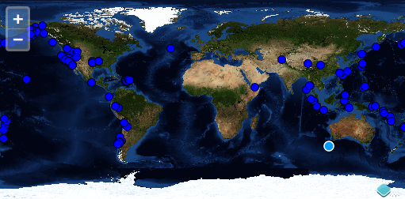

# Dessiner des objets géographiques

De nouveaux objets géographiques peuvent être dessinés en utilisant une `ol.interaction.Draw`. Une interaction de dessin est construite avec une source vecteur et un type de géométrie.

## Créer une couche vecteur et une interaction de type `Draw`

### Tâches

1.  Commençons avec l'exemple ci-dessous. Ouvrez `map.html` dans votre éditeur de texte et assurez-vous qu'il ressemble à ce qui suit:

  ```html
    <!doctype html>
    <html lang="en">
      <head>
        <link rel="stylesheet" href="/ol.css" type="text/css">
        <style>
        #map {
          height: 256px;
          width: 512px;
        }
        </style>
        <script src="/loader.js" type="text/javascript"></script>
        <title>OpenLayers example</title>
      </head>
      <body>
        <h1>My Map</h1>
        <div id="map"></div>
        <script type="text/javascript">
          var source = new ol.source.Vector({
            url: '/data/layers/7day-M2.5.json',
            format: new ol.format.GeoJSON()
          });
          var draw = new ol.interaction.Draw({
            source: source,
            type: 'Point'
          });
          var map = new ol.Map({
            interactions: ol.interaction.defaults().extend([draw]),
            target: 'map',
            layers: [
              new ol.layer.Tile({
                title: 'Global Imagery',
                source: new ol.source.TileWMS({
                  url: 'https://ahocevar.com/geoserver/wms',
                  params: {LAYERS: 'nasa:bluemarble', TILED: true}
                })
              }),
              new ol.layer.Vector({
                title: 'Earthquakes',
                source: source,
                style: new ol.style.Style({
                  image: new ol.style.Circle({
                    radius: 5,
                    fill: new ol.style.Fill({
                      color: '#0000FF'
                    }),
                    stroke: new ol.style.Stroke({
                      color: '#000000'
                    })
                  })
                })
              })
            ],
            view: new ol.View({
              projection: 'EPSG:4326',
              center: [0, 0],
              zoom: 1
            })
          });
        </script>
      </body>
    </html>
  ```

2.  Sauvez vos changements dans `map.html` et ouvrez la page dans votre navigateur:  {{ book.workshopUrl }}/map.html. Pour voir, le dessin de géométries de type point en action, cliquez sur la carte pour ajouter un nouvel objet géographique:

  

### Tâches bonus

1.  Créez un "listener" qui récupère les coordonnées X et Y du nouvel objet géographique après qu'il ait été dessiné.

### Solutions

Voici une solution pour la première tâche bonus. Dedans, nous assignons un "listener" pour l'événement `drawend` de `ol.interaction.Draw`. Cette méthode enregistre les X et Y de l'objet géographique dans la console des outils de développement du navigateur:

```python
def getCoor(evt):
  feature=evt.feature
  p = feature.getGeometry();
  console.log(p.getCoordinates())
  
draw.on('drawend', getCoor)
```
