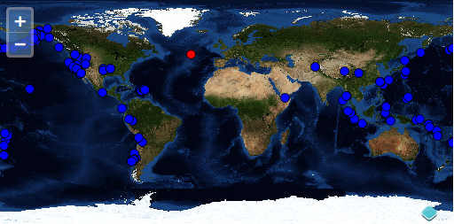

## Sélectionner des objets géographiques

Comme nous l'avons vu dans le module sur les couches, nous pouvons récupérer des objets géographiques comme des vecteurs et les dessinez par dessus une carte en fond dite "base". Un des avantages de servir des données vecteur est que les utilisateurs peuvent interagir avec la donnée. Dans cet exemple, nous créons une couche vecteur où les utilisateurs peuvent sélectionner et voir les informations des objets géographiques.

L'exemple précédent faisait la démonstration de l'utilisation d'un `ol.control.Control` sur la carte.  Les `controls` ont une représentation visuelle sur la carte ou ajoutent des éléments DOM au document.  Une `ol.interaction.Interaction` est responsable de gérer les interactions utilisateurs, mais typiquement sans représentation visuelle.  Cet exemple montre l'utilisation d'une `ol.interaction.Select` pour interagir avec les objets géographiques de couches vecteur.

## Créer un couche vecteur et une interaction de type `Select`

### Tâches

1. Commençons avec l'exemple avec la couche vecteur de la [section précédente](../layers/vector.md).  Ouvrez `map.html` dans votre éditeur de texte et assurez-vous qu'il ressemble à quelque chose comme suivant:

```html
<html>
<head>
<meta charset="utf-8" />
<script type="text/javascript" src="https://www.brython.info/src/brython.js"></script>
<script type="text/javascript" src="https://openlayers.org/en/v4.1.1/build/ol.js"></script>
<link rel="stylesheet" type="text/css" href="https://openlayers.org/en/v4.1.1/css/ol.css">
<style>
#map {
height: 400px;
width: 100%;
}
.ol-attribution a {
color: black;
}
</style>
</head>
<body onload="brython(1)">
<div id="map" class ="map"> </div>

<div id="info"></div>

<script type="text/python">
from browser import window, document
ol = window.ol

tremblements_terre=ol.layer.Vector.new({
       'title': 'Earthquakes',
       'source':  ol.source.Vector.new({
         'url': 'https://raw.githubusercontent.com/boundlessgeo/ol3-workshop/master/src/data/layers/7day-M2.5.json',
         'format':  ol.format.GeoJSON.new()
       }),
       'style':  ol.style.Style.new({
         'image':  ol.style.Circle.new({
           'radius': 5,
           'fill':  ol.style.Fill.new({
             'color': '#0000FF'
           }),
           'stroke':  ol.style.Stroke.new({
             'color': '#000000'
           })
         })
       })
      })


map =  ol.Map.new({
  'interactions': ol.interaction.defaults().extend([
    ol.interaction.Select.new({
      'style':  ol.style.Style.new({
        'image':  ol.style.Circle.new({
          'radius': 5,
          'fill':  ol.style.Fill.new({
            'color': '#FF0000'
          }),
          'stroke':  ol.style.Stroke.new({
            'color': '#000000'
          })
        })
      })
    })
  ]),
  'target': 'map',
  'layers': [
    ol.layer.Tile.new({
      'title': 'Global Imagery',
      'source':  ol.source.TileWMS.new({
        'url': 'https://ahocevar.com/geoserver/wms',
        'params': {'LAYERS': 'nasa:bluemarble', 'TILED': True}
       })
     }),
     tremblements_terre,
      ],
    'view':  ol.View.new({
    'projection': 'EPSG:4326',
    'center': [5.7626, 45.1734],
    'zoom': 1,
    'maxResolution': 0.703125
  })
})


def get_feature(e):
    ft = map.forEachFeatureAtPixel(e.pixel, lambda feature, layer: feature)
    info_element = document['info']
    #info_element.text = ft.getKeys()
    try:
        info_element.text = ft.get('title')
    except:
        info_element.text = ""

map.on('singleclick', get_feature) 
</script>
</body>
</html> 
```

2.  Sauvez vos changements de `map.html` et ouvrez la page dans votre navigateur:  {{ book.workshopUrl }}/map.html. Pour voir la sélection d'objets géographiques en action, utilisez le clic souris pour sélectionner un tremblement de terre:

  
