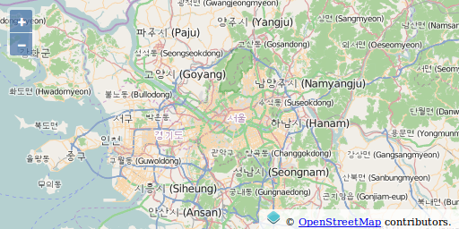

# Tuiles mises en cache

Par défaut, Une couche de type `Tile` fait des requêtes pour des images de 256 x 256 (pixel) pour remplir votre fenêtre d'affichage de carte et au delà. Au fur et à mesure des déplacements et zoom sur votre carte, plus de requêtes vers des images seront effectuées pour remplir les surfaces que vous n'avez pas encore visitées. Pendant que votre navigateur mettra en cache quelques unes des images demandées, une part importante du travail de traitement est typiquement requis côté serveur pour faire le rendu des images dynamiquement.

Comme les couches tuilées font des appels à des images en utilisant une grille régulière, il est possible pour le serveur de mettre en cache ces images demandées et retourner le résultat mis en cache, la prochaine fois que vous ou quelqu'un d'autre visitez la même zone - résultant en de meilleures performances.

## `ol.source.XYZ`

La spécification `Web Map Service` permet beaucoup de flexibilité par rapport à ce qu'un client peut demander. Sans contraintes, cela rend la mise en cache difficile ou impossible en pratique.

A l'extrême opposé, un service peut fournir des tuiles seulement à un jeu de niveaux de zoom fixe et seulement pour une grille régulière. Ce comportement peut être généralisé aux couches tuilées avec une source  de type `XYZ` - vous pouvez considérer que X et Y indiquent la colonne et la ligne de la grille et que le Z représente le niveau de zoom.

## `ol.source.OSM`

Le projet [OpenStreetMap (OSM)](http://www.openstreetmap.org/) est un effort  pour collecter et mettre à disposition des données cartographiques pour l'ensemble du monde. OSM fournit différents types de rendus des données sous forme de jeux de tuiles mis en cache. Ces rendus se conforment à l'arrangement de grille XYZ basique et peuvent être utilisés dans une carte OpenLayers. La source de la couche `ol.source.OSM` permet d'accéder aux tuiles OpenStreetMap.

### Tâches

1. Ouvrez le fichier `map.html` de la [section précédente](wms.md) dans votre éditeur de texte et changez le code d'initialisation de la carte pour qu'il ressemble à celui qui suit:

```python
<script type="text/python">
from browser import window
ol = window.ol

map = ol.Map.new({
  'target': 'map',
  'layers': [
    ol.layer.Tile.new({
      'source':  ol.source.OSM.new()
    })
  ],
  'view': ol.View.new({
    'center': ol.proj.fromLonLat([5.7626, 45.1734]),
    'zoom': 9,
  }),
  'controls': ol.control.defaults({
    'attributionOptions': {
      'collapsible': False
    }
  })
})
</script>
  ```

1. Dans le bloc `<head>` du même document, ajoutez quelques déclarations de style pour l'attribution de la couche.

```html
<style>
    #map {
        width: 512px;
        height: 256px;
    }
    .ol-attribution a {
        color: black;
    }
</style>
```

1. Sauvez vos changements et rafraichissez la page dans votre navigateur: {{ book.workshopUrl }}/map.html

  

## Revue de détails

### Les projections

Revoyons la définition d'une vue dans la carte:

```python
  'view':  ol.View.new({
    'center': ol.proj.fromLonLat([5.7626, 45.1734]),
    'zoom': 9
  }),
```

La donnée géospatiale peut venir dans n'importe quel système de coordonnées de référence. Un jeu de donnée peut utiliser des coordonnées géographiques (longitude et latitude) en degrés, et un autre peut avoir des coordonnées dans une projection locale avec des unités en mètres. Une discussion complète sur les systèmes de référence de coordonnées va bien au delà du périmètre de ce module mais il est néanmoins important de comprendre le concept de base.

OpenLayers doit connaître le système de coordonnées de votre donnée. En interne, cela est représenté avec un objet `ol.proj.Projection` mais des chaînes de caractère peuvent être aussi utilisées.

Les tuiles OpenStreetMap que nous utilisons sont dans une projection Mercator. Pour cette raison, nous devons définir initialement le centre en utilisant des coordonnées en Mercator. Comme il est relativement simple de trouver les coordonnées pour un point d'intérêt en coordonnées géographiques, nous utilisons la fonction `ol.proj.fromLonLat` pour transformer les coordonnées géographiques (`'EPSG:4326'`) en coordonnées Mercator (`'EPSG:3857'`).

### Création de couche

```python
  'layers': [
      ol.layer.Tile.new({
      'source': new ol.source.OSM()
    })
  ],
```

Comme précédemment, nous créons une couche et l'ajoutons au tableau de couches dans la configuration de notre objet carte `map`. Cette fois, nous acceptons toutes les options par défaut de la `source`.

### Style

```css
  .ol-attribution a {
    color: black;
  }
```

Un traitement des `controls` de la carte est en dehors du périmètre de ce module, mais ces déclarations de style vous donnent une léger avant-goût/aperçu. Par défaut, un `control` `ol.control.Attribution` est ajouté à toutes les cartes. Cela laisse les sources de couche afficher les informations d'attribution dans la fenêtre d'affichage de carte. Les déclarations ci-dessus changent le style de cette attribution pour notre carte (remarquez la ligne de Copyright au pied droit de la carte).

### Configuration du `control` pour l'attribution

Par défaut, `ol.control.Attribution` ajoute un bouton `i` (information) qui peut être pressé pour afficher réellement l'information d'attribution. Pour se conformer aux [termes d'utilisation d'OpenStreetMap](http://wiki.openstreetmap.org/wiki/FR:Questions_fr%C3%A9quentes_l%C3%A9gales), et toujours afficher l'information d'attribution d'OpenStreetMap, ce qui suit est utilisé dans les options de l'objet passé au constructeur `ol.Map`:

```python
  'controls': ol.control.defaults({
    'attributionOptions': {
      'collapsible': False
    }
  })
```

Cela enlève le bouton `i`, et rend l'information d'attribution toujours visible.

Après avoir maîtrisé les couches avec les jeux de tuiles mis en cache publics, passons au travail avec [les couches raster propriétaires](proprietary.md).
