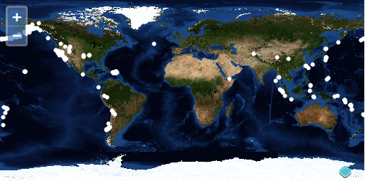

# Données vecteur

Les couches vecteur sont représentées par `ol.layer.Vector` et gère l'affichage côté client des données vecteur. Actuellement, OpenLayers supporte le rendu vecteur complet dans le moteur de rendu Canvas, mais seulement pour les points pour le moteur de rendu WebGL.

## Rendu des objets géographiques côté client

Revenons à l'exemple WMS pour avoir une carte du monde basique.  Nous allons ajouter quelques données géographiques au dessus, dans une couche vecteur.

```html
<html>
<head>
<meta charset="utf-8" />
<script type="text/javascript" src="https://www.brython.info/src/brython.js"></script>
<script type="text/javascript" src="https://openlayers.org/en/v4.1.1/build/ol.js"></script>
<link rel="stylesheet" type="text/css" href="https://openlayers.org/en/v4.1.1/css/ol.css">
<style>

#map {
height: 400px;
width: 100%;
}
.ol-attribution a {
color: black;
}
</style>
</head>
<body onload="brython(1)">
<div id="map" class ="map"> </div>

<script type="text/python">
from browser import window
ol = window.ol

map =  ol.Map.new({
  'target': 'map',
  'layers': [
    ol.layer.Tile.new({
      'title': 'Global Imagery',
      'source':  ol.source.TileWMS.new({
        'url': 'https://ahocevar.com/geoserver/wms',
        'params': {'LAYERS': 'nasa:bluemarble', 'TILED': True}
      })
    })
  ],
  'view':  ol.View.new({
    'projection': 'EPSG:4326',
    'center': [0, 0],
    'zoom': 0,
    'maxResolution': 0.703125
})
})
</script>
</body>
</html><html>
<head>
<meta charset="utf-8" />
<script type="text/javascript" src="https://www.brython.info/src/brython.js"></script>
<script type="text/javascript" src="https://openlayers.org/en/v4.1.1/build/ol.js"></script>
<link rel="stylesheet" type="text/css" href="https://openlayers.org/en/v4.1.1/css/ol.css">
<style>

#map {
height: 400px;
width: 100%;
}
.ol-attribution a {
color: black;
}
</style>
</head>
<body onload="brython(1)">
<div id="map" class ="map"> </div>

<script type="text/python">
from browser import window
ol = window.ol

map =  ol.Map.new({
  'target': 'map',
  'layers': [
    ol.layer.Tile.new({
      'title': 'Global Imagery',
      'source':  ol.source.TileWMS.new({
        'url': 'https://ahocevar.com/geoserver/wms',
        'params': {'LAYERS': 'nasa:bluemarble', 'TILED': True}
      })
    })
  ],
  'view':  ol.View.new({
    'projection': 'EPSG:4326',
    'center': [0, 0],
    'zoom': 0,
    'maxResolution': 0.703125
})
})
</script>
</body>
</html>
```

### Tâches

1. Ouvrez `map.html` dans votre éditeur de texte et copiez dedans le contenu de votre exemple WMS initial. Sauvez vos changements et confirmez que les choses fonctionnent bien dans votre navigateur: {{ book.workshopUrl }}/map.html

2. Dans votre code d'initialisation de la carte, ajoutez une autre couche après la couche tuilée (collez ce qui suit juste avant `],` ). Cela ajoute une nouvelle couche vecteur à votre carte qui demande un jeu d'objets géographiques sous format GeoJSON:

  ```python
    ol.layer.Vector.new({
      'title': 'Earthquakes',
      'source':  ol.source.Vector.new({
        'url': '7day-M2.5.json',
        'format':  ol.format.GeoJSON.new()
      }),
      'style':  ol.style.Style.new({
        'image':  ol.style.Circle.new({
          'radius': 3,
          'fill':  ol.style.Fill.new({'color': 'white'})
        })
     })
  })
  ```

  

### Revue de détails

Examinons la création de cette couche vecteur pour se faire une idée de ce qu'il se passe.

La couche se voit donner le titre (`title`) `'Earthquakes'` et quelques options personnalisées. Dans les options de l'objet, nous avons inclus une `source` de type `ol.source.Vector` qui pointe vers une URL. Nous avons donné à la `source` un `format` qui sera utilisé pour parser les données.

*Note* - Dans le cas où vous souhaiteriez styler les objets géographiques en utilisant un attribut, vous devrez utiliser une fonction style plutôt qu'un `ol.style.Style` dans les options de configuration du `style` de la couche `ol.layer.Vector`.

### Tâches bonus

1.  Les cercles blancs sur la carte représentent des objets `ol.Feature` sur votre couche `ol.layer.Vector`. Chacun de ces objets a des données d'attributs les propriétés `title` et `summary`. Assignez un événement de type `'singleclick'` sur votre carte qui appelle `forEachFeatureAtPixel` sur la carte et affiche les informations de tremblements de terre en dessous de la fenêtre d'affichage de carte.

2.  La donnée pour la couche vecteur vient du flux d'information sur les tremblements de terre publié par l'USGS (http://earthquake.usgs.gov/earthquakes/catalogs/).  Voyez si vous pouvez trouver des données additionnelles avec des informations spatiales dans un format supporté par OpenLayers.  Si vous sauvegardez un autre document représentant des données spatiales dans votre répertoire `data`, vous devriez être capable de le voir dans une couche vecteur sur votre carte.

### Solutions

Comme solution à la première tâche bonus, vous pouvez ajouter une div `info` en dessous de la carte:

```html
<div id="info"></div>
```

et ajouter le code JavaScript suivant pour afficher le titre de l'objet cliqué:

```js
map.on('singleclick', function(e) {
  var feature = map.forEachFeatureAtPixel(e.pixel, function(feature) {
    return feature;
  });
  var infoElement = document.getElementById('info');
  infoElement.innerHTML = feature ? feature.get('title') : '';
});
```
